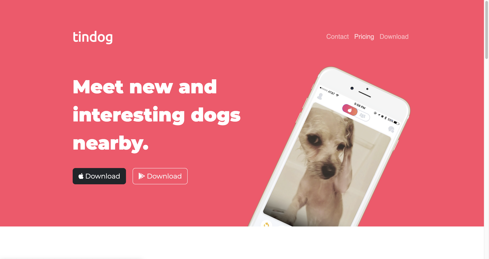
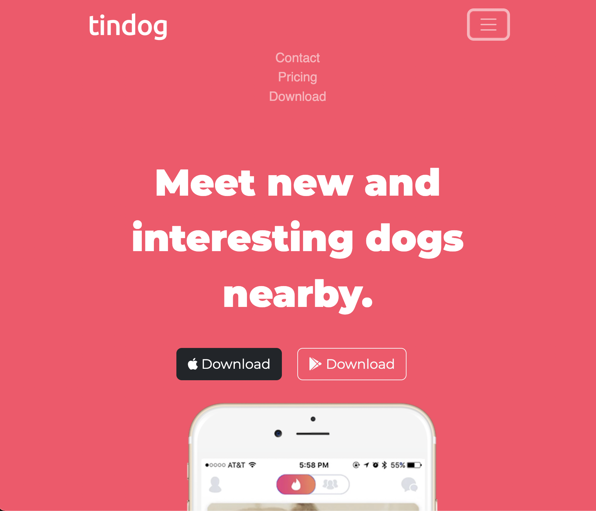
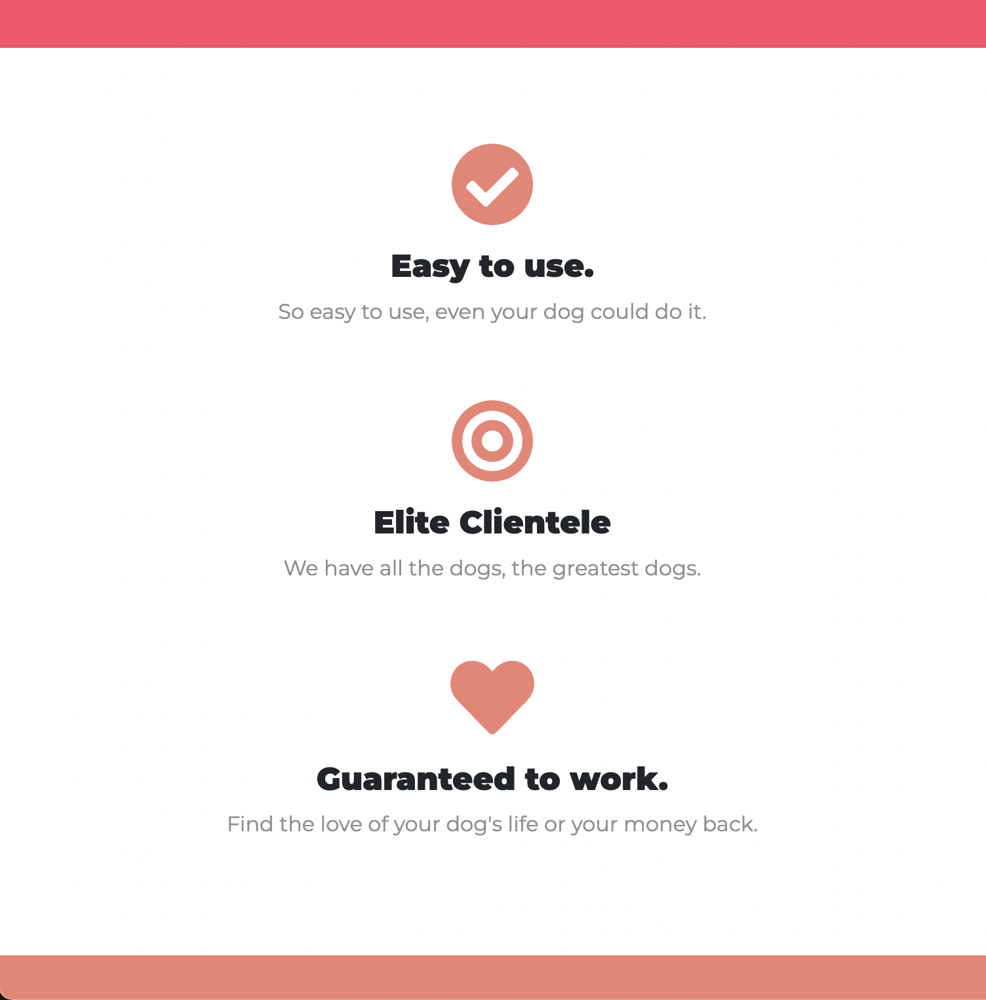
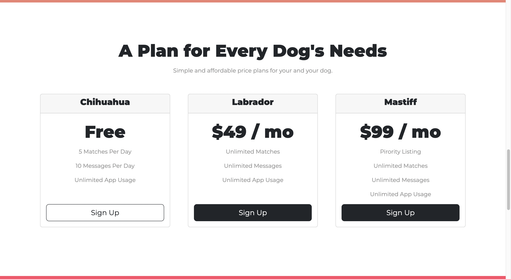
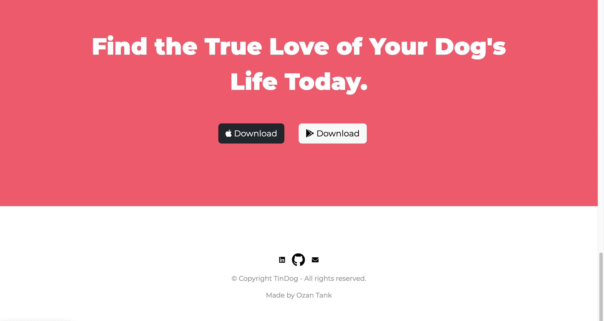

# Responsive Website 

This is my first responsive website project for different viewports (also including: active states, functional buttons etc).

## Table of contents

- [Overview](#overview)
  - [Screenshot](#screenshot)
  - [Links](#links)
- [My process](#my-process)
  - [Built with](#built-with)
  - [Useful resources](#useful-resources)

## Overview

Responsive website built with HTML, CSS and Bootstrap.

### Screenshot

### Links

- Live Site URL: [https://ozantank.github.io/tindog/](https://ozantank.github.io/tindog/)

## My process

I started building the structure with html and bootstrap. After I finished structuring, I styled it with CSS
to make it perfect for different viewports.

### Built with

- HTML5 
- CSS 
- Bootstrap

### Useful resources

- [Resource 1](https://fontawesome.com/) - This helped me with icons.
- [Resource 1](https://fonts.google.com/) - This helped me with fonts. 

